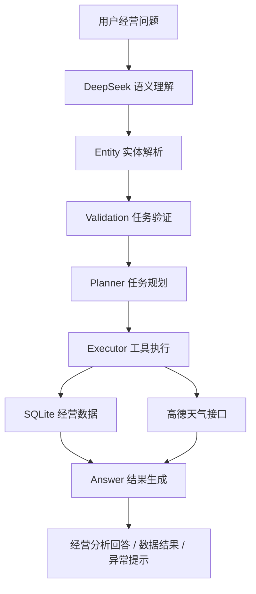

# 餐饮经营数据分析 Agent

一个面向餐饮经营场景的 AI 数据分析应用。

项目基于 FastAPI、LangGraph、DeepSeek、SQLite 与 React 构建，将自然语言理解、业务实体解析、任务规划、数据分析工具调用、多轮上下文记忆和结果生成串联成完整 Agent Workflow。

用户可以直接通过自然语言查询营业额、订单量、客单价、商品销售表现、门店品类表现和经营趋势，也可以进行跨月份比较、多指标分析以及天气与经营数据的组合查询。

---

## 核心能力

### 1. 经营数据分析

支持查询：

- 总营业额
- 订单量
- 客单价
- 商品销售额
- 商品销量
- 门店品类营业额
- 商品与品类排行
- 最近周期经营趋势
- 多月份数据对比

示例：

```text
五月总营业额是多少？
六月可乐卖了多少份？
最近订单量变化怎么样？
五月和六月可乐销售额对比一下。
六月牛肉和三文鱼卖了多少？
```

---

### 2. 商品实体归一化

支持商品简称、自然表达与标准商品名称之间的映射。

例如：

```text
牛肉
→ 牛肉poke

三文鱼
→ 三文鱼poke

鸡肉
→ 鸡肉poke
```

当商品表达存在多个合理候选时，Agent 不会强行猜测，而是进入澄清流程。

---

### 3. 多意图任务拆解

一个问题中可以同时包含多个经营分析任务。

例如：

```text
六月牛肉卖了多少，最近客单价怎么样？
```

Agent 会拆解为：

```text
商品销售分析
+
客单价趋势分析
```

分别执行后再合并结果。

---

### 4. 多轮上下文理解

支持连续追问、条件切换和历史任务引用。

例如：

```text
用户：五月可乐卖了多少钱？
用户：那六月呢？
```

系统可以继承商品和指标，仅切换时间。

同时能够区分：

```text
再看看六月
```

与：

```text
和六月比呢
```

前者属于时间切换，后者属于时间比较。

---

### 5. 长对话结构化记忆

Agent 维护原始对话历史、当前结构化上下文以及结构化业务记忆。

当前实现支持约 20 轮业务上下文记忆，可处理类似：

```text
回到最开始牛肉那个查询，改成六月。
```

这类跨多轮历史引用。

---

### 6. 澄清与部分成功处理

对于无法唯一识别的商品：

```text
六月 poke 卖了多少？
```

系统会提示可能对应：

```text
三文鱼poke
鸡肉poke
牛肉poke
```

并要求用户进一步确认。

对于同时包含支持能力与能力外请求的问题，系统会优先完成可执行部分，并对能力外部分单独说明。

---

### 7. 数据范围安全校验

时间查询范围由 SQLite 中真实销售数据动态决定，而不是在代码中写死月份白名单。

当前示例数据范围为：

```text
2026-05-01 ~ 2026-07-31
```

因此：

```text
五月 / 六月 / 七月
```

可以正常查询。

而：

```text
四月 / 八月
```

在当前数据集下会返回数据范围提示。

后续数据库加入新的月份后，无需修改业务查询代码即可扩展时间范围。

---

### 8. 天气查询

项目已接入高德开放平台天气能力。

支持：

```text
北京今天天气怎么样？
上海明天天气怎么样？
北京今天会下雨吗？
```

也支持天气与经营分析组合：

```text
北京今天会下雨吗？
顺便看看最近总营业额变化怎么样？
```

---

## 系统架构



---

## Agent Workflow

当前 LangGraph 主流程：

```text
understanding
    ↓
entity
    ↓
validation
    ↓
planner
    ↓
executor
    ↓
answer
```

其中还包含：

```text
clarification
unsupported
partial clarification
partial unsupported
planning failed
```

等异常和分支处理能力。

### Understanding

负责：

- 用户意图识别
- 多任务拆解
- 时间表达理解
- 指标识别
- query mode 判断
- 多轮上下文继承

### Entity

负责：

- 商品实体识别
- 商品别名映射
- 歧义候选识别
- 实体置信度处理

### Validation

负责：

- 判断任务是否完整
- 处理商品歧义
- 处理部分可执行任务
- 处理能力外请求

### Planner

将结构化业务任务转换成可执行计划。

### Executor

根据任务类型调用对应业务工具。

### Answer

负责把工具结果转换成用户可理解的经营分析回答。

---

## 技术栈

### Backend

- Python
- FastAPI
- LangGraph
- LangChain Core
- DeepSeek API
- SQLite
- Pandas
- python-dotenv

### Frontend

- React 19
- Vite 8
- Oxlint
- JavaScript

### External Service

- DeepSeek
- 高德开放平台天气 API

---

## 项目结构

```text
work1/
├─ backend/
│  ├─ agent/
│  │  ├─ graph.py
│  │  ├─ nodes.py
│  │  ├─ planner.py
│  │  ├─ executor.py
│  │  ├─ langgraph_agent.py
│  │  └─ state.py
│  │
│  ├─ services/
│  │  ├─ llm_service.py
│  │  ├─ entity_service.py
│  │  ├─ time_service.py
│  │  └─ answer_service.py
│  │
│  ├─ tools/
│  ├─ test/
│  └─ main.py
│
├─ frontend/
│  ├─ src/
│  │  ├─ App.jsx
│  │  ├─ ManagementPages.jsx
│  │  ├─ App.css
│  │  ├─ index.css
│  │  └─ main.jsx
│  └─ package.json
│
├─ data/
│  ├─ processed/
│  ├─ product_alias.json
│  └─ moneki.db
│
├─ scripts/
│  ├─ clean_data.py
│  ├─ init_database.py
│  └─ inspect_data.py
│
├─ .env.example
├─ requirements.txt
└─ README.md
```

`data/moneki.db` 为本地生成文件，不提交到 Git 仓库。

---

## 环境变量

复制：

```text
.env.example
```

创建本地：

```text
.env
```

配置：

```env
DEEPSEEK_API_KEY=your_deepseek_api_key
AMAP_API_KEY=your_amap_api_key
```

请勿将真实 API Key 提交到 Git 仓库。

---

## 后端安装

建议在项目根目录创建 Python 虚拟环境。

安装依赖：

```bash
pip install -r requirements.txt
```

---

## 数据库初始化

数据库初始化脚本读取：

```text
data/processed/sales.csv
data/processed/stores.csv
data/processed/products.csv
```

并生成：

```text
data/moneki.db
```

在项目根目录执行：

```bash
python scripts/init_database.py
```

数据库包含：

```text
sales
stores
products
```

三张主要业务表。

---

## 启动后端

进入：

```bash
cd backend
```

启动 FastAPI：

```bash
python -m uvicorn main:app --host 127.0.0.1 --port 8001
```

服务地址：

```text
http://127.0.0.1:8001
```

健康检查：

```text
GET /api/health
```

---

## 启动前端

进入：

```bash
cd frontend
```

安装依赖：

```bash
npm install
```

启动：

```bash
npm run dev
```

Vite 会输出实际访问地址。

---

## API

### Health

```http
GET /api/health
```

### Dashboard

```http
GET /api/dashboard
```

返回当前数据库最新月份的经营概览。

### Products

```http
GET /api/products
```

返回最新月份商品销售数据。

### Stores

```http
GET /api/stores
```

返回门店经营分析数据。

### Analytics

```http
GET /api/analytics
```

支持经营数据筛选与时间范围分析。

例如：

```text
/api/analytics?months=1
/api/analytics?months=2
/api/analytics?months=3
```

还可结合门店、品类和商品筛选条件。

### Agent Chat

```http
POST /api/chat
```

用于自然语言经营分析对话。

---

## 前端经营分析后台

前端包含：

- Dashboard
- 销售分析
- 商品分析
- 门店分析
- 经营分析
- 数据中心
- AI 对话助手

经营页面统一基于后端真实数据接口。

页面支持：

- 时间范围切换
- 商品筛选
- 门店筛选
- 品类筛选
- KPI 汇总
- 商品排行
- 门店排行
- 趋势分析

刷新浏览器时会保持当前页面状态。

当新的 Analytics 请求失败时，页面会清除上一轮旧结果，避免旧数据被误认为当前筛选结果。

---

## 数据准确性设计

项目在经营数据计算中重点处理了以下问题：

### 跨门店订单去重

全局订单数按照订单 ID 去重计算，避免同一订单跨门店数据导致重复统计。

### 动态时间范围

查询时间范围由数据库：

```sql
MIN(date)
MAX(date)
```

动态确定。

### 最近周期

“最近”不是写死某个月份，而是根据数据库最新完整月份动态计算。

### Analytics 时间标签

时间标签与真实查询范围保持一致：

```text
1个月 → 2026年7月
2个月 → 最近2个月
3个月 → 最近3个月
```

---

## 测试与验收

项目包含两类测试：

### 自动化契约测试

用于锁定核心数据和关键页面计算契约。

主要覆盖：

- SQLite 数据基线
- 时间服务
- 总营业额
- 订单量
- 客单价
- 商品销售
- Dashboard
- Store Dashboard
- Analytics

### Agent 回归脚本

用于验证完整 Agent 行为。

覆盖：

- 商品销售额
- 商品销量
- 订单量
- 时间切换
- 时间比较
- 多意图
- 商品实体归一化
- 跨月份比较
- 上下文继承
- 20 轮结构化记忆
- 澄清
- 部分能力外请求
- 时间越界
- 天气
- 天气与经营数据混合分析

前端通过：

```bash
npm run lint
npm run build
```

进行代码检查与生产构建验证。

---

## 当前示例数据

当前 SQLite 示例数据：

```text
时间范围：2026-05-01 ~ 2026-07-31
销售记录：11944
门店数量：5
商品数量：20
```

当前数据最新月份为：

```text
2026年7月
```

对应：

```text
营业额：151572
订单量：4212
客单价：35.99
商品销量：7034
```

---

## 能力边界

当前版本重点聚焦：

```text
餐饮经营数据分析
+
多轮 Agent
+
天气辅助信息
```

新闻意图的扩展结构目前已经预留，但当前版本未接入完整新闻执行工具，因此不将新闻查询作为已实现功能。

对于超出当前能力范围的问题，Agent 会返回能力范围提示，而不是生成未经验证的业务结果。

---

## 项目特点

这个项目并不是单纯的 Chat UI 或大模型问答 Demo。

核心重点包括：

- 数据驱动时间解析
- SQLite 真实经营数据计算
- LangGraph Workflow
- DeepSeek 结构化意图理解
- 多任务规划与执行
- 商品实体归一化
- 多轮上下文与结构化记忆
- 澄清与部分成功机制
- 内外部工具协同
- 数据计算契约测试
- 前后端完整经营分析界面
